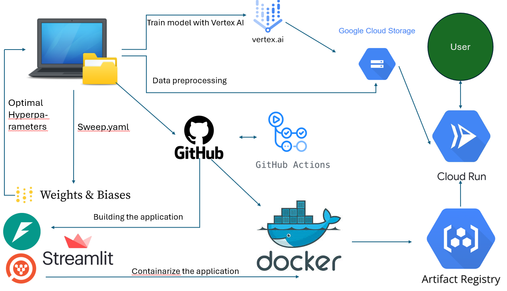

# Classification of skin cancer

DTU exam project for MLOPS 2025 - Group 17

## Project description
The overall goal of the project is to build a tool for classifying if a patient has melanoma skin cancer or not. A user of the tool should be able to upload an image of a birthmark, and a classification model will output the class "cancer" or "no cancer". This tool can be very important for users to use to detect skin cancer at an early phase. For users to trust such a tool, explainability of the model output is important. Hence, a focus in this project will be to add an extra layer of explanation of the model output, which is of importance to the users and to assist medical staff in further analysis of the potential of melanoma cancer.
  
To include explanability into this project we intend to use the Captum framework.
  
Our data for this project is a dataset consiting of 10,000 images with benign and malign birthmarks from Kaggle - https://www.kaggle.com/datasets/hasnainjaved/melanoma-skin-cancer-dataset-of-10000-images/data. The dataset has a size of 100 MB.
  
As our classification model we will apply the ResNet-18 with pretrained weights from pytorch. We intend to fine-tune the final fully connected layer on our specific melanoma skin cancer dataset.

## Project architecture overview

Created using [mlops_template](https://github.com/SkafteNicki/mlops_template),
a [cookiecutter template](https://github.com/cookiecutter/cookiecutter) for getting
started with Machine Learning Operations (MLOps).
