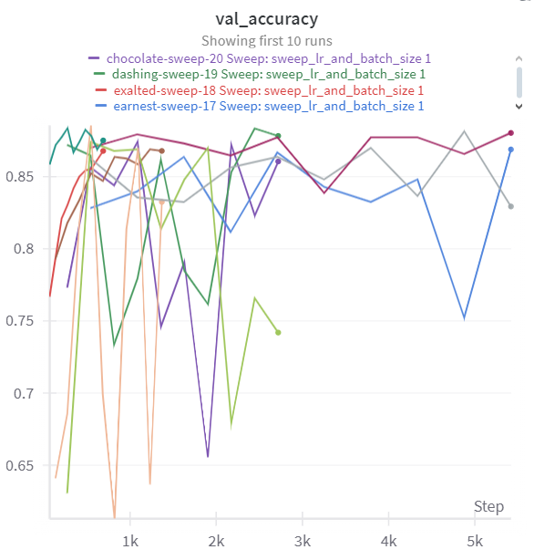
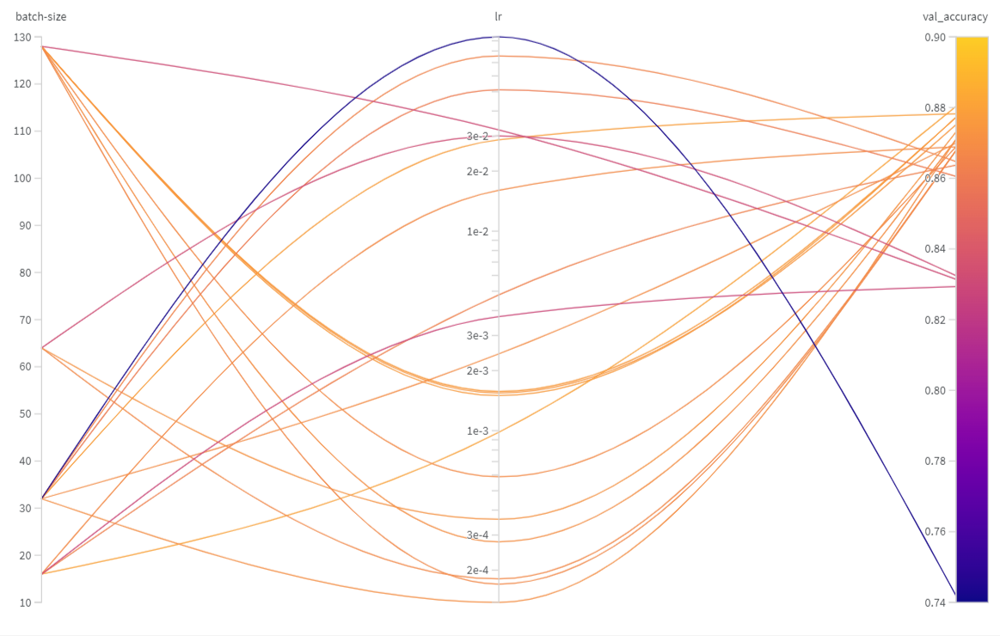
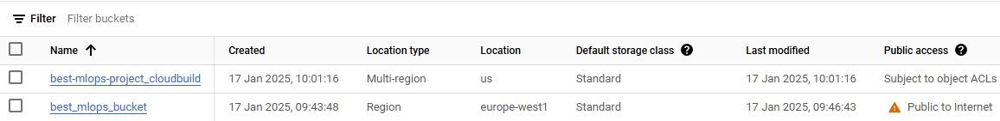
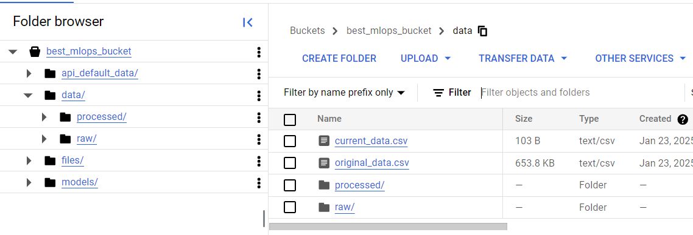
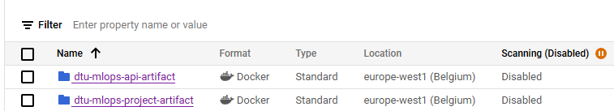
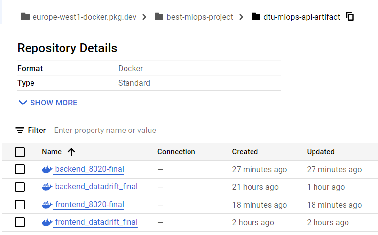
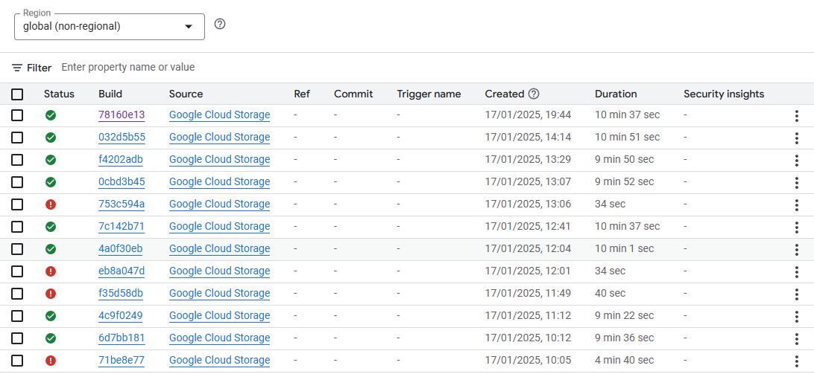
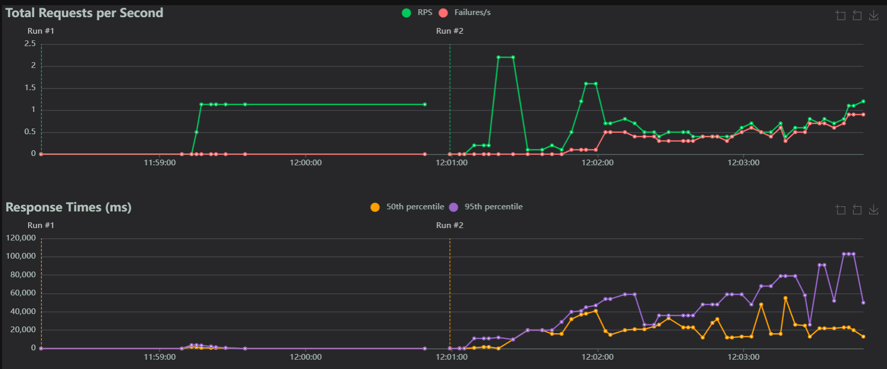
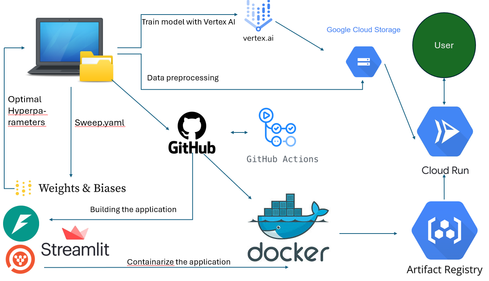

# Exam template for 02476 Machine Learning Operations

This is the report template for the exam. Please only remove the text formatted as with three dashes in front and behind
like:

```--- question 1 fill here ---```

Where you instead should add your answers. Any other changes may have unwanted consequences when your report is
auto-generated at the end of the course. For questions where you are asked to include images, start by adding the image
to the `figures` subfolder (please only use `.png`, `.jpg` or `.jpeg`) and then add the following code in your answer:

```markdown

```

In addition to this markdown file, we also provide the `report.py` script that provides two utility functions:

Running:

```bash
python report.py html
```

Will generate a `.html` page of your report. After the deadline for answering this template, we will auto-scrape
everything in this `reports` folder and then use this utility to generate a `.html` page that will be your serve
as your final hand-in.

Running

```bash
python report.py check
```

Will check your answers in this template against the constraints listed for each question e.g. is your answer too
short, too long, or have you included an image when asked. For both functions to work you mustn't rename anything.
The script has two dependencies that can be installed with

```bash
pip install typer markdown
```

## Overall project checklist

The checklist is *exhaustive* which means that it includes everything that you could do on the project included in the
curriculum in this course. Therefore, we do not expect at all that you have checked all boxes at the end of the project.
The parenthesis at the end indicates what module the bullet point is related to. Please be honest in your answers, we
will check the repositories and the code to verify your answers.

### Week 1

* [X] Create a git repository (M5)
* [X] Make sure that all team members have write access to the GitHub repository (M5)
* [X] Create a dedicated environment for you project to keep track of your packages (M2)
* [X] Create the initial file structure using cookiecutter with an appropriate template (M6)
* [X] Fill out the `data.py` file such that it downloads whatever data you need and preprocesses it (if necessary) (M6)
* [X] Add a model to `model.py` and a training procedure to `train.py` and get that running (M6)
* [X] Remember to fill out the `requirements.txt` and `requirements_dev.txt` file with whatever dependencies that you
    are using (M2+M6)
* [X] Remember to comply with good coding practices (`pep8`) while doing the project (M7)
* [X] Do a bit of code typing and remember to document essential parts of your code (M7)
* [] Setup version control for your data or part of your data (M8)
* [X] Add command line interfaces and project commands to your code where it makes sense (M9)
* [X] Construct one or multiple docker files for your code (M10)
* [X] Build the docker files locally and make sure they work as intended (M10)
* [X] Write one or multiple configurations files for your experiments (M11)
* [] Used Hydra to load the configurations and manage your hyperparameters (M11)
* [] Use profiling to optimize your code (M12)
* [X] Use logging to log important events in your code (M14)
* [X] Use Weights & Biases to log training progress and other important metrics/artifacts in your code (M14)
* [X] Consider running a hyperparameter optimization sweep (M14)
* [] Use PyTorch-lightning (if applicable) to reduce the amount of boilerplate in your code (M15)

### Week 2

* [X] Write unit tests related to the data part of your code (M16)
* [X] Write unit tests related to model construction and or model training (M16)
* [X] Calculate the code coverage (M16)
* [X] Get some continuous integration running on the GitHub repository (M17)
* [X] Add caching and multi-os/python/pytorch testing to your continuous integration (M17)
* [X] Add a linting step to your continuous integration (M17)
* [X] Add pre-commit hooks to your version control setup (M18)
* [] Add a continues workflow that triggers when data changes (M19)
* [] Add a continues workflow that triggers when changes to the model registry is made (M19)
* [X] Create a data storage in GCP Bucket for your data and link this with your data version control setup (M21)
* [ ] Create a trigger workflow for automatically building your docker images (M21)
* [X] Get your model training in GCP using either the Engine or Vertex AI (M21)
* [X] Create a FastAPI application that can do inference using your model (M22)
* [X] Deploy your model in GCP using either Functions or Run as the backend (M23)
* [X] Write API tests for your application and setup continues integration for these (M24)
* [X] Load test your application (M24)
* [] Create a more specialized ML-deployment API using either ONNX or BentoML, or both (M25)
* [X] Create a frontend for your API (M26)

### Week 3

* [X] Check how robust your model is towards data drifting (M27)
* [X] Deploy to the cloud a drift detection API (M27)
* [] Instrument your API with a couple of system metrics (M28)
* [] Setup cloud monitoring of your instrumented application (M28)
* [] Create one or more alert systems in GCP to alert you if your app is not behaving correctly (M28)
* [] If applicable, optimize the performance of your data loading using distributed data loading (M29)
* [] If applicable, optimize the performance of your training pipeline by using distributed training (M30)
* [] Play around with quantization, compilation and pruning for you trained models to increase inference speed (M31)

### Extra

* [X] Write some documentation for your application (M32)
* [] Publish the documentation to GitHub Pages (M32)
* [X] Revisit your initial project description. Did the project turn out as you wanted?
* [ ] Create an architectural diagram over your MLOps pipeline
* [X] Make sure all group members have an understanding about all parts of the project
* [X] Uploaded all your code to GitHub

## Group information

### Question 1
> **Enter the group number you signed up on <learn.inside.dtu.dk>**
>
> Answer:

17

### Question 2
> **Enter the study number for each member in the group**
>
> Example:
>
> *sXXXXXX, sXXXXXX, sXXXXXX*
>
> Answer:

s204658, s204646, s204654, s223517

### Question 3
> **A requirement to the project is that you include a third-party package not covered in the course. What framework**
> **did you choose to work with and did it help you complete the project?**
>
> Recommended answer length: 100-200 words.
>
> Example:
> *We used the third-party framework ... in our project. We used functionality ... and functionality ... from the*
> *package to do ... and ... in our project*.
>
> Answer:

The project we have decided to work with is to determine whether or not a patient has melanoma skin cancer by analyzing an image. Since this is related to the patient's health, the output of our model should be good but also be able to provide information on why it determined the class to be something specific. In order to do this the framework called "captum" have been used to be able to use several different explainability tool (LIME, IG, SHAP, etc.) to get an understanding on how the model behaves. Captum also fits our stack quite well, since a restnet from pytorch have been used, which allows us for seamlessly integration since they are in the same tech eco-system.

## Coding environment

> In the following section we are interested in learning more about you local development environment. This includes
> how you managed dependencies, the structure of your code and how you managed code quality.

### Question 4

> **Explain how you managed dependencies in your project? Explain the process a new team member would have to go**
> **through to get an exact copy of your environment.**
>
> Recommended answer length: 100-200 words
>
> Example:
> *We used ... for managing our dependencies. The list of dependencies was auto-generated using ... . To get a*
> *complete copy of our development environment, one would have to run the following commands*
>
> Answer:

Managing dependencies can be quite difficult without proper setup - therefore the group have opted on using tasks.py and the invoke package to automate some of the tedious processes. We have several requirement files to keep track on our packages - for instance we have the requirement_dev.txt which is packages used solely during development (such as invoke), while requirements.txt is for the application to work. We have several invoke commands to automatically create an environment for you by using the createenvironment command - afterwards the requirements command can be used to download all packages in requirements.txt and with these two simple steps you have all the packages needed to run the "application"! The same steps can be taken to download the dev-tools. When updating the packages the tool called pipreqs have been used to automatically update the requirement.txt file throughout the development process. You can also manually insert packages into the requirement files.

### Question 5

> **We expect that you initialized your project using the cookiecutter template. Explain the overall structure of your**
> **code. What did you fill out? Did you deviate from the template in some way?**
>
> Recommended answer length: 100-200 words
>
> Example:
> *From the cookiecutter template we have filled out the ... , ... and ... folder. We have removed the ... folder*
> *because we did not use any ... in our project. We have added an ... folder that contains ... for running our*
> *experiments.*
>
> Answer:

We have generally speaking not changed any of the structure from the cookiecuter template presented in the course. However, we did add several new files and folders to solve our specific problem. We have added several files such as data_statistics.py and train_gcp.py to get an overview of our data as well as separated training the model via cloud using vertex AI, respectively. Furthermore, an api_default_data folder have been added for the user to make inference on selected "birthmark" images in case the user have no images themselves to test the model within our application. Evaluate.py is empty - this is because the evaluation have been integrated inside the visualization.py file.
Otherwise most of the folders have been filled out such as tests, configs, dockerfiles, models, several requirement files, etc.

### Question 6

> **Did you implement any rules for code quality and format? What about typing and documentation? Additionally,**
> **explain with your own words why these concepts matters in larger projects.**
>
> Recommended answer length: 100-200 words.
>
> Example:
> *We used ... for linting and ... for formatting. We also used ... for typing and ... for documentation. These*
> *concepts are important in larger projects because ... . For example, typing ...*
>
> Answer:

It was clear that working with several people can lead to inconsistent declaration of variables, classes, etc. and therefore a "guideline" was needed. We opted for the PEP-8 guideline, which was also presented during the course to make the code easy to read and understand. However, sometimes formating can be hard to be uphold when coding and therefore invoke commands have been used again to make sure formatting is being implemented everywhere - this has been done by using the ruff package and mypy in our linting-command to easily format the code.

These concepts matter a lot in larger projects due to the fact that larger projects generally speaking have large amount of code and "interaction" between code. If formatting and "styling" isn't in place, then the code can become very difficult to read and understand, which makes it harder for people to debug or contribute (in open source projects).

## Version control

> In the following section we are interested in how version control was used in your project during development to
> corporate and increase the quality of your code.

### Question 7

> **How many tests did you implement and what are they testing in your code?**
>
> Recommended answer length: 50-100 words.
>
> Example:
> *In total we have implemented X tests. Primarily we are testing ... and ... as these the most critical parts of our*
> *application but also ... .*
>
> Answer:

Several aspects of the codebase have been tested - we are currently testing the model, data and api, as these are the most important part of our project. Specifically we check whether the model and data have the correct input and out shapes. For the api we are testing whether the class probabilities sum to 1 and if the prediction matches the highest probability class. However, we could spend more time and effort on expanding the test cases to also include edge cases and test other applications.

### Question 8

> **What is the total code coverage (in percentage) of your code? If your code had a code coverage of 100% (or close**
> **to), would you still trust it to be error free? Explain you reasoning.**
>
> Recommended answer length: 100-200 words.
>
> Example:
> *The total code coverage of code is X%, which includes all our source code. We are far from 100% coverage of our **
> *code and even if we were then...*
>
> Answer:

The code coverage for the api, data and model are as follows: 40%, 60% and 100%, respectively which is calculated every time a branch is being merged into master.
Even if the code coverage is 100%, that doesn't mean that the code is error free. If we get 0 error, then that is solely because the tests that have been created is good, but there might be bugs or errors that we haven't considered testing (for instance edge cases or obscure circumstances) which won't be registered.

### Question 9

> **Did you workflow include using branches and pull requests? If yes, explain how. If not, explain how branches and**
> **pull request can help improve version control.**
>
> Recommended answer length: 100-200 words.
>
> Example:
> *We made use of both branches and PRs in our project. In our group, each member had an branch that they worked on in*
> *addition to the main branch. To merge code we ...*
>
> Answer:

Both branches and pull requests have been used during our development. Working directly in the master branch is very dangerous as changes "can" result in bugs and errors which halts the process (where we have to revert to a previous commit). To circumvent this problem, branches can be used - when a certain feature wants to be implemented, a new branch can be made that essentially contain the implemented feature. When satisfied a pull request can be created and the group members can look at the changes made (and what files it affects). This is very neat, since CI can be implmeneted using github actions where the merge can also only happen if all the tests have been correctlly completed.

### Question 10

> **Did you use DVC for managing data in your project? If yes, then how did it improve your project to have version**
> **control of your data. If no, explain a case where it would be beneficial to have version control of your data.**
>
> Recommended answer length: 100-200 words.
>
> Example:
> *We did make use of DVC in the following way: ... . In the end it helped us in ... for controlling ... part of our*
> *pipeline*
>
> Answer:

DVC have been linked our data bucket, where cache files have been created as well as the config files associated to DVC. However, while the setup was successful, the commands DVC add and DVC push poses some issues, thus the group instead utilized gcloud functions to load and upload the data. In our project DVC is not essential given the training data is not changing at all, but we could imagine cases that DVC would be essential when the data changes over time and the model is continuously trained. In this case, DVC would be very useful to keep track of the data and the models that are being trained if we want to go back and look at a specific model.

### Question 11

> **Discuss you continuous integration setup. What kind of continuous integration are you running (unittesting,**
> **linting, etc.)? Do you test multiple operating systems, Python  version etc. Do you make use of caching? Feel free**
> **to insert a link to one of your GitHub actions workflow.**
>
> Recommended answer length: 200-300 words.
>
> Example:
> *We have organized our continuous integration into 3 separate files: one for doing ..., one for running ... testing*
> *and one for running ... . In particular for our ..., we used ... .An example of a triggered workflow can be seen*
> *here: <weblink>*
>
> Answer:

As mentioned previously, Github Actions is used to implement continuous integration. We test multiple operating systems (OS) to make sure that the codebase is OS agnostic. All of the tests are also run with a specific python version, which in this case is python 3.12. Precommit is also being run, where white trailing spaces, yaml files, etc. are being checked. Formatting is also being run using the ruff package, to make sure that all code is being formatted correctly before being integrated to the master branch. These are done by using the files in the .github/workflows folder (such as codecheck.yaml, tests.yaml and pre-commit.yaml). If we had more time triggers could have been utilized to automatically build the docker images when for instance code changes were made and make cml_data.yaml work for DVC. When the raw data has been changed, then the new data should be preprocessed and automatically pushed using DVC, but this was not working as mentioned earlier. As part of the cookiecutter template, dependabot have been added to automatically look for updates to our packages, which makes it to have the latest compatible versions of the packages.

## Running code and tracking experiments

> In the following section we are interested in learning more about the experimental setup for running your code and
> especially the reproducibility of your experiments.

### Question 12

> **How did you configure experiments? Did you make use of config files? Explain with coding examples of how you would**
> **run a experiment.**
>
> Recommended answer length: 50-100 words.
>
> Example:
> *We used a simple argparser, that worked in the following way: Python  my_script.py --lr 1e-3 --batch_size 25*
>
> Answer:

At first hydra was being thought of the way to run the experiments, but we decided instead for weights and biases as our platform to document our experiments. The project have been shared with all group members which also make it easy to see who ran what and with what configuration. These result are then stored in our weights and biases report.

A link to the report in W&B, where we used our sweep.yaml file to find the optimal hyperparameters - the link to the report can be found here: <https://wandb.ai/s204654-danmarks-tekniske-universitet-dtu/mlops_project/reports/Results-from-training-the-model-using-sweep-yaml--VmlldzoxMTA0Mjg3MA>

### Question 13

> **Reproducibility of experiments are important. Related to the last question, how did you secure that no information**
> **is lost when running experiments and that your experiments are reproducible?**
>
> Recommended answer length: 100-200 words.
>
> Example:
> *We made use of config files. Whenever an experiment is run the following happens: ... . To reproduce an experiment*
> *one would have to do ...*
>
> Answer:

To ensure that no information was lost during the experiments, we have used weights and biases to document the experiments as mentioned previously. This allowed us to see who ran what project and with what configuration as this is stored. This also makes it easy to reproduce the experiments, since the configuration file is stored in the weights and biases website. Furthermore W&B also stores the output of the experiments in a wandb folder, which again helps with reproducibility of the experiments.

### Question 14

> **Upload 1 to 3 screenshots that show the experiments that you have done in W&B (or another experiment tracking**
> **service of your choice). This may include loss graphs, logged images, hyperparameter sweeps etc. You can take**
> **inspiration from [this figure](figures/wandb.png). Explain what metrics you are tracking and why they are**
> **important.**
>
> Recommended answer length: 200-300 words + 1 to 3 screenshots.
>
> Example:
> *As seen in the first image when have tracked ... and ... which both inform us about ... in our experiments.*
> *As seen in the second image we are also tracking ... and ...*
>
> Answer:

All images come from the W&B report which can be found in question 12. The data that have been used have been downloaded from kaggle, which was already split into train and test - as part of our training, we find it benefecial to utilize 10% of the training data as our validation data - therefore the rest of the training data to to fine-tune the model. A screen showing the validation accuracy for different configurations used in our sweep (where batch sizes and learning rate were the two hyperparameters of interest) can be seen below:



It is clear that for most configurations, that the accuracy is quite with, which sits at around 85% accuracy, while some configurations performance poorly on the validation set with around 75% accuracy. This is important to track, since it gives us an indication on how the model behaves on unseen data.

Another plot that shows the validation accuracy for the different configurations of batch size and learning rate and its corresponding validation accuracy can be seen below:



Again we see that depending on the configuration different validation accuracy can be aqcuired - Note that generally speaking a medium learning rate seems to perform best, while higher learning rates seem to generalize poorly on the validation data. Based on the results from the sweep we decided to use batch size = 16 and a learning rate of 0.0009806, which gave us the best validation accuracy at around 88%


### Question 15

> **Docker is an important tool for creating containerized applications. Explain how you used docker in your**
> **experiments/project? Include how you would run your docker images and include a link to one of your docker files.**
>
> Recommended answer length: 100-200 words.
>
> Example:
> *For our project we developed several images: one for training, inference and deployment. For example to run the*
> *training docker image: `docker run trainer:latest lr=1e-3 batch_size=64`. Link to docker file: <weblink>*
>
> Answer:

We have created several docker files during the project: One for training using vertex AI, and two for deployment of our backend and frontend. You can readily build them byy simply running the docker run comamnd - All of our dockerfiles are placed in the dockerfiles folder, where a link to the backend can be seen here: <dockerfiles/backend.dockerfile>
To build the backend dockerfile simply type: `docker build -f dockerfiles/backend.dockerfile . -t backend_test:latest`
Afterwards the backend be run by typing the following command: `docker run backend_test:latest`

### Question 16

> **When running into bugs while trying to run your experiments, how did you perform debugging? Additionally, did you**
> **try to profile your code or do you think it is already perfect?**
>
> Recommended answer length: 100-200 words.
>
> Example:
> *Debugging method was dependent on group member. Some just used ... and others used ... . We did a single profiling*
> *run of our main code at some point that showed ...*
>
> Answer:

Members have different ways of debugging the code. However one thing that all did was to put a few print statements to get a clear understanding of the behaviour of the code. Another approach that people also used is VSC's debugging panel, that works wonderfully. However this was mainly used when the error message was unclear and therefore difficult to understand what type of error the code outputted. We all also followed the idea of starting simple and testing it locally before and then moving to building the docker images and testing them locally before deploying them to the cloud. Google cloud also have good logging capabilities which we have utilized many times to debug the code when building the images were failing.

## Working in the cloud

> In the following section we would like to know more about your experience when developing in the cloud.

### Question 17

> **List all the GCP services that you made use of in your project and shortly explain what each service does?**
>
> Recommended answer length: 50-200 words.
>
> Example:
> *We used the following two services: Engine and Bucket. Engine is used for... and Bucket is used for...*
>
> Answer:

Several Services have been used to make this project work:

- Data storage (bucket): A project bucket has been created that will contain all the data and models that is being used to run the application. This makes it easy to have a centralized storage where we can freely add or retrieve data from.
- Vertex AI: This is a platform to build and deploy models in a simpler manner. We have used it to train our restnet on the data which reside in the bucket.
- Cloud run: Cloud run have been used to deploy and run the application continously. This is done by using the docker images for the api (which have been placed in the artifact registry) to create the application.
Artifact Registry: This has been used to store all of our docker images, which makes it way easier to integrate to other parts of services that google cloud offers (for instance Cloud run and Vertex AI).

### Question 18

> **The backbone of GCP is the Compute engine. Explained how you made use of this service and what type of VMs**
> **you used?**
>
> Recommended answer length: 100-200 words.
>
> Example:
> *We used the compute engine to run our ... . We used instances with the following hardware: ... and we started the*
> *using a custom container: ...*
>
> Answer:

Compute engine hasn't been used in this project, since we have used Vertex AI to train the model instead. We have created a yaml file called config_vertexAI.yaml to be able to train the model on Vertex AI, where the machine type that have been used is n1-highmem-4 with a single replica count. This allowed us to rent the hardware to be able to train the model. However, it still took a long time to train the model. Given more time, more focus on selecting correct machine type could have been done to speed up the training process without expending too many credits.

### Question 19

> **Insert 1-2 images of your GCP bucket, such that we can see what data you have stored in it.**
> **You can take inspiration from [this figure](figures/bucket.png).**
>
> Answer:



Looking specifically in best_mlops_bucket, which contain our data we see the following:



We see that we have several folders, some for the data (both raw and processed) and some for the models.

A path to the bucket (which has public access) can be found here: <best_mlops_bucket/data>


### Question 20

> **Upload 1-2 images of your GCP artifact registry, such that we can see the different docker images that you have**
> **stored. You can take inspiration from [this figure](figures/registry.png).**
>
> Answer:

An image that shows the docker foldes used in the project can be seen below:



Where the api-artifact is the docker image for our application while the other folder is for training - looking further into the api-artifact we have these:



Where it is seen we have different verions of the backend and frontend

### Question 21

> **Upload 1-2 images of your GCP cloud build history, so we can see the history of the images that have been build in**
> **your project. You can take inspiration from [this figure](figures/build.png).**
>
> Answer:



It is clear that several builds have been run, some of them failing and some of them actually succeeding. The builds include training and first version of the backend and frontend (i.e. the application).

### Question 22

> **Did you manage to train your model in the cloud using either the Engine or Vertex AI? If yes, explain how you did**
> **it. If not, describe why.**
>
> Recommended answer length: 100-200 words.
>
> Example:
> *We managed to train our model in the cloud using the Engine. We did this by ... . The reason we choose the Engine*
> *was because ...*
>
> Answer:

As mentioned previously, Vertex AI have been used to train the model - this has been done by using the train_gcp.py file which trains the model on cloud. Not only that in order to actually run the model a config file was created in the configs folder called config_vertexAI.yaml, that specifies which VM to use, which docker image to run, etc. This is very neat, since this enables us to train fast and efficiently over cloud, and thus won't limit the hardware we have in possession locally. However, our experience was that the training was quite slow where doing it locally was way faster. We suspect it is due to the amount of ressources we have allocated. Given the model only needed to be trained once the training optimization part haven't been our main focus.

## Deployment

### Question 23

> **Did you manage to write an API for your model? If yes, explain how you did it and if you did anything special. If**
> **not, explain how you would do it.**
>
> Recommended answer length: 100-200 words.
>
> Example:
> *We did manage to write an API for our model. We used FastAPI to do this. We did this by ... . We also added ...*
> *to the API to make it more ...*
>
> Answer:

We did manage to write an api for our model - This has been done by using FastAPI, where the model is loaded, the user add an image and afterwards inference is performed to get the predicted class as well as a plot of the attribution created by using captum (in this case Integrated Gradients). The frontend then plots the result for the user to see - the user can then add another image if they want where the process is repeated. A button that allows the user to navigate to the data drift page have been added as well. As part of the building process, the api was first tested before building and dockers and deployed using the cloud run service.
A link to the application can be found here: <https://frontend-8020-final-424957459314.europe-west1.run.app>

### Question 24

> **Did you manage to deploy your API, either in locally or cloud? If not, describe why. If yes, describe how and**
> **preferably how you invoke your deployed service?**
>
> Recommended answer length: 100-200 words.
>
> Example:
> *For deployment we wrapped our model into application using ... . We first tried locally serving the model, which*
> *worked. Afterwards we deployed it in the cloud, using ... . To invoke the service an user would call*
> *`curl -X POST -F "file=@file.json"<weburl>`*
>
> Answer:

As mentioned previously, a backend was created using FastAPI. However, we did accompany the backend with a frontend using streamlit to better create a good looking application, which works as intended locally - however, in order to run the application locally, the backend needs to be activated and afterwards the streamlit command needs to be run by using the streamlit run function to display the results and make it for the user to interact with the application.
The link to the application can be seen here: <https://frontend-8020-final-424957459314.europe-west1.run.app>

### Question 25

> **Did you perform any unit testing and load testing of your API? If yes, explain how you did it and what results for**
> **the load testing did you get. If not, explain how you would do it.**
>
> Recommended answer length: 100-200 words.
>
> Example:
> *For unit testing we used ... and for load testing we used ... . The results of the load testing showed that ...*
> *before the service crashed.*
>
> Answer:

Both unit testing and load testing have been performed to test both the code and the application during development. Unit testing have been performed by using the pytest framework. Load testing have been performed by using the locust framework, where the application have been testing by spawning several users to use the application. For load testing a locust file have been made called locustfile.py in test/performancetests folder. We only load tested the backend. Running the locust file with the backend api as our entrypoint (link:<https://backend-8020-final-424957459314.europe-west1.run.app>) we obtain the following chart:



It is clear that the application is quite slow (especially the predict endpoint). This is mainly caused by Captum's integrated gradients operation, which takes a long time to compute and also loading the model can be time consuming as well. This also sometimes results in limited access to some of the features in the app, when it is overloaded.

### Question 26

> **Did you manage to implement monitoring of your deployed model? If yes, explain how it works. If not, explain how**
> **monitoring would help the longevity of your application.**
>
> Recommended answer length: 100-200 words.
>
> Example:
> *We did not manage to implement monitoring. We would like to have monitoring implemented such that over time we could*
> *measure ... and ... that would inform us about this ... behaviour of our application.*
>
> Answer:

As part of our application a small button can be clicked to navigate to our data drift page (link: <https://backend-8020-final-424957459314.europe-west1.run.app/data_drift/>). When an individual uploads an image, the application will perform feature extractions (average brightness, contrast, sharpness and prediction from the model) and compare it with the trained and test data we have had originally (which both are saved in a csv file). This allows us to detect any data drifts and the developers can take actions based on the user's uploaded images to determine whether or not the model is still applicable to the uploaded images.

## Overall discussion of project

> In the following section we would like you to think about the general structure of your project.

### Question 27

> **How many credits did you end up using during the project and what service was most expensive? In general what do**
> **you think about working in the cloud?**
>
> Recommended answer length: 100-200 words.
>
> Example:
> *Group member 1 used ..., Group member 2 used ..., in total ... credits was spend during development. The service*
> *costing the most was ... due to ... . Working in the cloud was ...*
>
> Answer:

By far the most expensive service was compute engine and vertex AI where members have spent multiple dollars on training or related to training. Working in the cloud is quite useful, especially for large projects or projects that require a lot of compute. This is because the cloud can provide with a lot of compute power that is in no way comparable to the hardware the group had in possession locally. It also enables the entire group to access the data (via data bucket) and the docker images that is in our artifact registry. This also allows for easy and quick versioning control of the data and models. While the cloud is very useful, it can also be quite tedious when pushing docker images to cloud where a lot of time was spent waiting on the images to be uploaded and run on the cloud.

### Question 28

> **Did you implement anything extra in your project that is not covered by other questions? Maybe you implemented**
> **a frontend for your API, use extra version control features, a drift detection service, a kubernetes cluster etc.**
> **If yes, explain what you did and why.**
>
> Recommended answer length: 0-200 words.
>
> Example:
> *We implemented a frontend for our API. We did this because we wanted to show the user ... . The frontend was*
> *implemented using ...*
>
> Answer:

We have done several extra features in our project. We created a streamlit frontend for the backend to make it an easier time for the users to navigate the application's functionalities and overall increase the user-friendliness. We have also developed a data drift service, where the application will save the uploaded image and perform feature extraction (brightness, Contrast, Sharpness, etc.) and compare it with our "current" data, which is all done in our /data_drift tab - the frontend also enables us to see this by clicking on the data drift tab. This is very useful, since it can give us an indication on how the model behaves over time and whether or not the model is still relevant as mentioned previously.

### Question 29

> **Include a figure that describes the overall architecture of your system and what services that you make use of.**
> **You can take inspiration from [this figure](figures/overview.png). Additionally, in your own words, explain the**
> **overall steps in figure.**
>
> Recommended answer length: 200-400 words
>
> Example:
>
> *The starting point of the diagram is our local setup, where we integrated ... and ... and ... into our code.*
> *Whenever we commit code and push to GitHub, it auto triggers ... and ... . From there the diagram shows ...*
>
> Answer:

An image that shows the overall architecture of the system can be seen below:



We start the architecture on our local machine where the development of our code takes place. We heavily use github and its features such as branches, pull requests and github actions to properly do version control of the code. Using W&B we perform several configurations by running the sweep.yaml file which enabled to find the optimal hyperparameters values, which have been used to train the model on the cloud using Vertex AI, where the resulting model is stored in our google cloud storage bucket. Preprocessing have been performed as well on all the data and have been stored in the same google cloud storage bucket. To enable the user to interact with the model an application have been made using FastAPI and streamlit (backend and frontend, respectively). The images have been built in docker where it afterwards have been deployed to the cloud using the artifact registry. The application is then run on google cloud run, who also uses the data and trained model from the google cloud storage bucket to enable the user to upload images where the model performs inference and predicts whether or not the person has melanoma. In addition we use the functionalities from captum to create an attribution image that assists the user to understand why the model predicted the class it did. The user can also navigate to the data drift page to see how the uploaded images deviate from the original data (if it does).


### Question 30

> **Discuss the overall struggles of the project. Where did you spend most time and what did you do to overcome these**
> **challenges?**
>
> Recommended answer length: 200-400 words.
>
> Example:
> *The biggest challenges in the project was using ... tool to do ... . The reason for this was ...*
>
> Answer:

Overall many struggles have occured during the project. However, the main struggle that all group members have faced is the communication between the developers (the group) and google cloud. This is mainly about having issues concerning permissions and accesses, which was both frustrating and also time consuming. Another part of using the cloud that became frustating is to make sure that github and google cloud was able to communicate with each other properly (by using secret keys), but this also posed some issues.
Although a lot of issues have been faced, the group have managed to utilize the cloud to build, integrate and deploy a large deep learning model.
While this wasn't frustating to make it work, building the docker images and deploying them to the cloud could be very time consuming - it was especially annoying when you spent almost an hour to build an image only to realize that a small mistake spelling mistake or a missing file was the reason for the build to fail.

### Question 31

> **State the individual contributions of each team member. This is required information from DTU, because we need to**
> **make sure all members contributed actively to the project. Additionally, state if/how you have used generative AI**
> **tools in your project.**
>
> Recommended answer length: 50-300 words.
>
> Example:
> *Student sXXXXXX was in charge of developing of setting up the initial cookie cutter project and developing of the*
> *docker containers for training our applications.*
> *Student sXXXXXX was in charge of training our models in the cloud and deploying them afterwards.*
> *All members contributed to code by...*
> *We have used ChatGPT to help debug our code. Additionally, we used GitHub Copilot to help write some of our code.*
> Answer:

All group members have been actively participating in the project equally. Everyone had the opportunity to work on all parts of the project to make sure that everyone had the opportunity to use the tools and frameworks that were used during the course. Generative AI have also been used to help build and debug the code (i.e. Github Copilot, but also OpenAI's ChatGPT).
